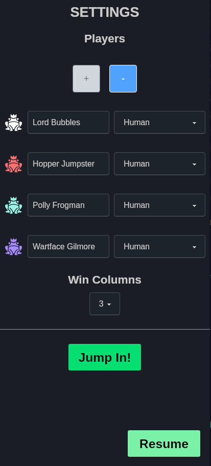
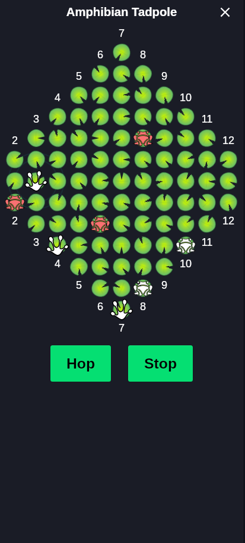
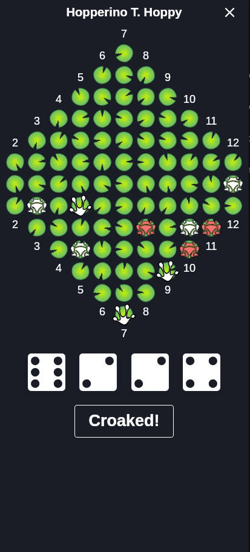
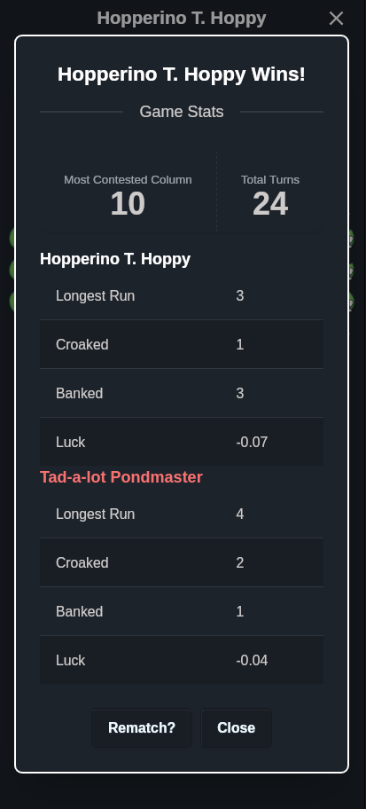

# Can't Hop

This is a game for fun, playing around with Tauri.  Its a push your luck game, called Can't Stop with a froggy twist.  You roll dice and decide whether to stick or risk your position to move forward. (Hop or Stop).

You roll four dice and pair them up to select columns to progress on.

Each run you choose up to three columns to progress and then must roll at least one of those columns again each turn.

If you can't roll the numbers you need you go bust (Croaked!) and lose your progress this turn.

## Features

- Up to four players locally
- Bot opponents with three risk levels
- Randomised silly frog name generator
- Tutorial mode
- End game stats

## Technology

This is a Tauri App designed for mobile first.  It uses a React/TypeScript/Tailwindcss stack for the UI.

## Screenshots

